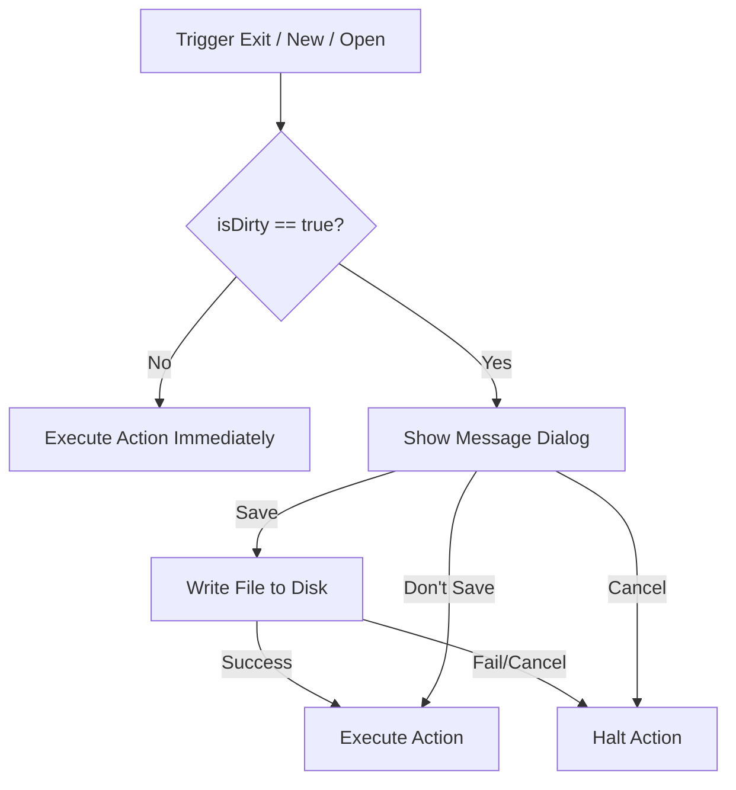

# NC IDE — Week 1 Foundation Prototype (v0.1.0)

NC IDE is a lightweight, fast, developer-first desktop IDE built on **Electron**, **React**, and **Monaco Editor**, designed with a clean, extensible modular architecture.

---

## 🚀 Tech Stack

| Layer | Technology | Purpose |
| --- | --- | --- |
| **Desktop Shell** | Electron | Native OS windows, Dialog overlays, Native menus |
| **Frontend Framework** | React 18 & TypeScript | Component modularity and type-safe UI views |
| **Editor Core** | Monaco Editor (`@monaco-editor/react`) | VS Code's editor component, enabling syntax highlighting |
| **State Management** | Zustand | Lightweight store for active files and editor configuration |
| **Build System** | Vite & Electron-Vite | Fast hot-module-reloading and multi-process builds |
| **Styling** | CSS Custom Variables | Custom dark themes and HSL design tokens |

---

## 📁 Modular Architecture

The source code conforms strictly to the modular structure outlined below, ensuring separate areas of concern do not bleed across boundaries:

```
c:/Users/A/OneDrive/Documents/NC IDE/
├── index.html                   # Vite entry page
├── electron.vite.config.ts      # Multi-process bundler configuration
├── package.json                 # Project dependencies & scripts
├── tsconfig.json                # TypeScript project setups
└── src/
    ├── main/                    # ELECTRON MAIN PROCESS
    │   ├── main.ts              # App bootstrap & window lifecycle
    │   ├── menu.ts              # Native application menu & accelerators
    │   └── ipc/
    │       └── fileHandlers.ts  # Node fs dialogues and unsaved changes confirmation
    ├── preload/                 # PRELOAD BRIDGE
    │   └── preload.ts           # Exposes safe IPC channels to the renderer
    ├── shared/                  # SHARED CONTRACTS
    │   ├── ipcChannels.ts       # Central channel constants
    │   └── types.ts             # TypeScript definitions for window.api
    └── modules/                 # RENDERER MODULES
        ├── editor/              # EDITOR MODULE
        │   ├── EditorView.tsx   # Monaco wrapper & change listners
        │   ├── editor.store.ts  # Cursor pos & editor instance tracking
        │   └── editor.types.ts  # Interface files
        ├── files/               # FILE MODULE
        │   ├── activeFile.store.ts # File content and dirty state store
        │   └── fileService.ts   # Save, Save As, and Open logic
        ├── ui/                  # UI VIEW SHELLS
        │   ├── MenuBar.tsx      # Window TitleBar header
        │   ├── Toolbar.tsx      # Action icons (New, Open, Save, Undo, Redo)
        │   ├── StatusBar.tsx    # CursorLn, Col, Language, and Encoding display
        │   ├── Workspace.tsx    # Overall layout builder
        │   └── shortcuts.ts     # IPC menu keyboard hooks
        └── theme/               # DESIGN SYSTEM & THEMES
            ├── tokens.css       # Global design variables & layouts
            ├── theme.types.ts   # Configuration types
            └── monacoTheme.ts   # Monaco custom color mapping
```

---

## 🔄 IPC Bridge Protocol

All file operations go through secure IPC channels using `ipcMain.handle` / `contextBridge` to avoid exposing Node APIs directly to the Web app.

| Channel Name | Flow | Purpose |
| --- | --- | --- |
| `file:open` | Renderer ➔ Main | Opens native Open dialog; returns file path and content. |
| `file:save` | Renderer ➔ Main | Writes content to an existing file path. |
| `file:save-as` | Renderer ➔ Main | Opens native Save dialog and saves content to a new path. |
| `file:unsaved-dialog` | Renderer ➔ Main | Opens message box prompting *Save*, *Don't Save*, or *Cancel*. |
| `menu:new` | Main ➔ Renderer | Triggers creation of a new, untitled buffer. |
| `menu:open` | Main ➔ Renderer | Triggers file loading. |
| `menu:save` | Main ➔ Renderer | Triggers active buffer save. |
| `menu:save-as` | Main ➔ Renderer | Triggers save-as dialog. |
| `app:close-request` | Main ➔ Renderer | Requests window closure check. |
| `app:close-confirmed` | Renderer ➔ Main | Notifies main process that it is safe to close. |

---

## 💾 State Stores

### 1. File Store (`activeFile.store.ts`)
Tracks the active document state:
* `filePath` (`string | null`): Path of the file currently open.
* `content` (`string`): Unsaved changes in the editor.
* `savedContent` (`string`): Text matching the document on disk.
* `isDirty` (`boolean`): Automatically flipped to `true` if `content !== savedContent`. Controls the titlebar `●` status and the Save button active state.
* `recentFiles` (`string[]`): Tracks recently opened items.

### 2. Editor Store (`editor.store.ts`)
Tracks configuration and editor status:
* `cursorLine` / `cursorCol`: Caret indices.
* `languageMode`: Currently active language syntax mode.
* `fontSize` / `wordWrap`: View options.
* `editorInstance`: Holds the Monaco Editor instance pointer, enabling remote actions (such as Undo/Redo click callbacks).

---

## 🔒 Unsaved Changes Guard Protocol

If a user tries to close the application, open a file, or create a new file while the active file has unsaved changes (`isDirty === true`), a warning dialog displays:



---

## 🛠️ How to Build and Run

### Prerequisites
* **Node.js**: v20 or higher
* **npm**: v10 or higher

### Installation
```bash
npm install
```

### Run Development Mode
```bash
npm run dev
```

### Build for Production
```bash
npm run build
```
