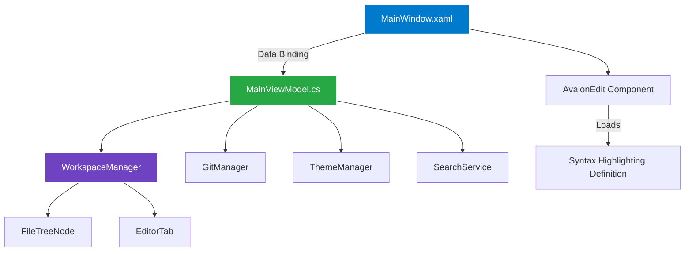

# Welcome to the NC IDE Wiki!

NC IDE is a high-performance, native code editor built with WPF and C#. It features a VS Code-inspired architecture utilizing the MVVM pattern.

## Architecture

NC IDE relies on a robust Model-View-ViewModel (MVVM) architecture to separate concerns, ensuring that the UI remains responsive and the codebase is highly testable.

### Core Components



## Snippets & Under the Hood

### 1. Lazy-Loading Dummy Node Strategy
To handle massive file systems instantly (such as large `node_modules` folders), the `WorkspaceManager` uses a Dummy Node Strategy. Directories are populated with a single empty "dummy" node, and the real contents are only loaded when the user expands the folder in the UI.

```csharp
// Models/FileTreeNode.cs
public class FileTreeNode : ObservableObject
{
    public string FullPath { get; set; }
    public bool IsDirectory { get; set; }
    public ObservableCollection<FileTreeNode> Children { get; } = new();

    private bool _isExpanded;
    public bool IsExpanded 
    {
        get => _isExpanded;
        set 
        {
            if (SetProperty(ref _isExpanded, value) && value && IsDummy)
            {
                OnExpanded?.Invoke(this); // Triggers real folder load
            }
        }
    }
}
```

### 2. Dynamic Syntax Highlighting
Syntax highlighting is managed by AvalonEdit. When a file is opened, the editor dynamically matches the file extension to a syntax highlighting definition.

```csharp
// UI/Views/MainWindow.xaml.cs
private void ApplySyntaxHighlighting(string filePath)
{
    string extension = System.IO.Path.GetExtension(filePath);
    var definition = HighlightingManager.Instance.GetDefinitionByExtension(extension);
    CodeEditor.SyntaxHighlighting = definition;
}
```

## Setup & Contributing
Check out the [main repository's README](../README.md) for instructions on how to run and contribute to the project!
